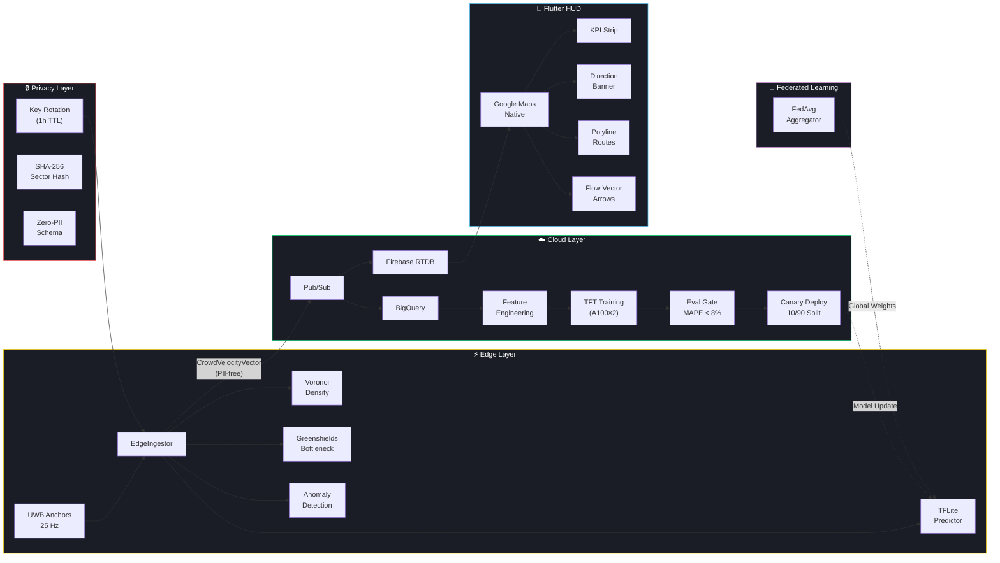

# Autonomous Venue Control Plane (AVCP) — v2.1.0 (Nav-Sync)

[](https://github.com/sudeep-07-hub/Physical-Event-Experience/actions/workflows/ci.yml)

> Real-time, privacy-first crowd intelligence for 50,000+ seat stadiums.
> Zero PII. Edge-native. Predictive navigation.

AVCP is an enterprise-grade venue intelligence engine that solves crowd physics at scale. It combines UWB sensor fusion, federated learning, and a predictive Flutter HUD to guide attendees safely through high-density environments — without ever collecting a single piece of personal data.

---

## 🏗️ System Architecture



---

## 🚀 Key Innovations

### Predictive Intent HUD
A dynamic instruction engine that thresholds localized physics (UWB Proximity, Density, Dwell Ratios) to automatically pivot the UI between 4 states: `Free Flowing`, `Heavy Wait`, `Rerouting`, and `Near Gate`.

### Coordinate-Locked Routing
Migrated from screen-space overlays to native **Google Maps Polylines & Markers**, eliminating the "floating route" bug during pinch/zoom/pan.

### Zero-PII Privacy Engine
All navigation logic is processed locally using anonymized `ZoneId` mapping and physics vectors. No identities, facial data, or persistent device IDs are ever stored. Sector hashes rotate hourly via SHA-256.

### Federated Learning (FedAvg)
Edge nodes train locally on crowd physics vectors and push **only gradient weights** to the central aggregator — raw data never leaves the device.

### Pre-Rendered Marker Ecosystem
High-DPI (`2.0x+`) vector markers are rendered at runtime using `dart:ui`, ensuring sharp infrastructure icons across all mobile pixel densities.

---

## 🛡️ Federated Edge Intelligence

Instead of streaming raw GPS coordinates to a central server:

1. **Edge Ingestion**: UWB anchors calculate crowd velocities locally at **25 Hz**.
2. **Voronoi Tessellation**: Density is computed per-zone using adaptive Voronoi cell areas.
3. **Greenshields Model**: Bottleneck scores are derived from the classic traffic-flow fundamental diagram.
4. **Anonymized Vectors**: Minimal physics vectors are pushed to Pub/Sub with rotated sector hashes.
5. **Digital Twin Sync**: The venue's Digital Twin simulates 10k additional agents to predict bottlenecks 5 minutes ahead.

---

## ⚙️ Tech Stack

| Layer | Technology | Purpose |
|-------|-----------|---------|
| **Frontend** | Flutter 3.x, Riverpod 2.x | Reactive HUD with strict provider decoupling |
| **Maps** | Google Maps Native | Dark-styled, geo-anchored polylines & markers |
| **Rendering** | `dart:ui` Canvas | High-DPI flow vectors & repaint boundaries |
| **Edge** | Python, ZMQ, SciPy | 25 Hz UWB frame processing, Voronoi density |
| **ML** | PyTorch TFT, Vertex AI | Temporal Fusion Transformer for crowd prediction |
| **Privacy** | SHA-256, UUID4 | Hourly key rotation, session-scoped identifiers |
| **Serving** | FastAPI, Docker | Vertex AI custom container serving |
| **Data** | Firebase RTDB, BigQuery | Real-time streams + historical analytics |
| **Federated** | PyTorch, FedAvg | Privacy-preserving distributed model training |
| **CI/CD** | GitHub Actions (4-stage) | Unit tests → Security scan → Load tests → Flutter tests |

---

## 🧪 Testing & CI

The CI pipeline runs **4 stages** on every push:

| Stage | Gate | Blocks Merge? |
|-------|------|:---:|
| 🧪 Unit Tests (Python 3.11 + 3.12) | Coverage report | ✅ |
| 🔒 Security Scan (Bandit + pub audit) | No HIGH/CRITICAL findings | ✅ |
| 📊 Load Tests (Locust, PR only) | p99 < 100ms, errors < 0.1% | ✅ |
| 📱 Flutter Tests | All widget + integration tests pass | ✅ |

### Key Test Files
- `tests/test_pii.py` — Verifies zero PII leakage in all schema fields
- `tests/test_circuit_breaker.py` — Circuit breaker state machine validation
- `tests/test_anomaly.py` — Anomaly detection against synthetic surge data
- `tests/test_bottleneck.py` — Greenshields model boundary conditions
- `avcp_flutter/test/wayfinding/` — Coordinate sync, direction banner, gate intent

---

## 🏃 Getting Started

### Backend (Edge + Serving)
```bash
# Install Python dependencies
pip install -e ".[dev]"

# Run the FastAPI serving endpoint
python serve.py

# Run tests
pytest tests/ -v --cov=avcp
```

### Frontend (Flutter HUD)
```bash
cd avcp_flutter
flutter pub get
dart run build_runner build --delete-conflicting-outputs

# Run in mock mode
flutter run --dart-define=MOCK_DATA=true

# Run tests
flutter test --coverage
```

### Docker (Production Serving)
```bash
docker build -t gcr.io/avcp-prod/tft-serving:latest .
docker run -p 8080:8080 gcr.io/avcp-prod/tft-serving:latest
```

---

## 📁 Project Structure

```
├── avcp/                          # Python edge + ML layer
│   ├── edge_ingestor.py           # UWB → CrowdVelocityVector pipeline
│   ├── schema.py                  # Immutable, PII-free data schema
│   ├── key_rotation.py            # Hourly sector hash rotation
│   ├── publishers.py              # Pub/Sub fan-out
│   ├── federated_server.py        # FedAvg aggregation server
│   └── vertex/                    # Vertex AI pipeline + predictor
│       ├── pipeline.py            # KFP pipeline definition
│       ├── crowd_predictor.py     # Circuit-breaker Vertex AI client
│       └── model_config.yaml      # Model hyperparameters
├── avcp_flutter/                  # Flutter HUD application
│   ├── lib/
│   │   ├── dashboard.dart         # Glanceable dashboard (map + KPI)
│   │   ├── wayfinding/            # Navigation screen + direction banner
│   │   ├── providers.dart         # Riverpod state management
│   │   ├── services/              # Firebase, maps, crowd analysis
│   │   └── models/                # Freezed data models
│   └── test/                      # Widget + unit tests
├── tests/                         # Python test suite
│   ├── load/                      # Locust load tests
│   └── security/                  # Security-focused tests
├── .github/workflows/ci.yml       # 4-stage CI pipeline
├── Dockerfile                     # Production serving container
├── serve.py                       # FastAPI entry point
└── stadium.json                   # Vertex AI KFP pipeline spec
```

---

**Note:** A valid Google Maps API Key is required in `web/index.html` and `AndroidManifest.xml` for production map tile rendering.

## 📄 License

This project is licensed under the MIT License — see the [LICENSE](LICENSE) file for details.
